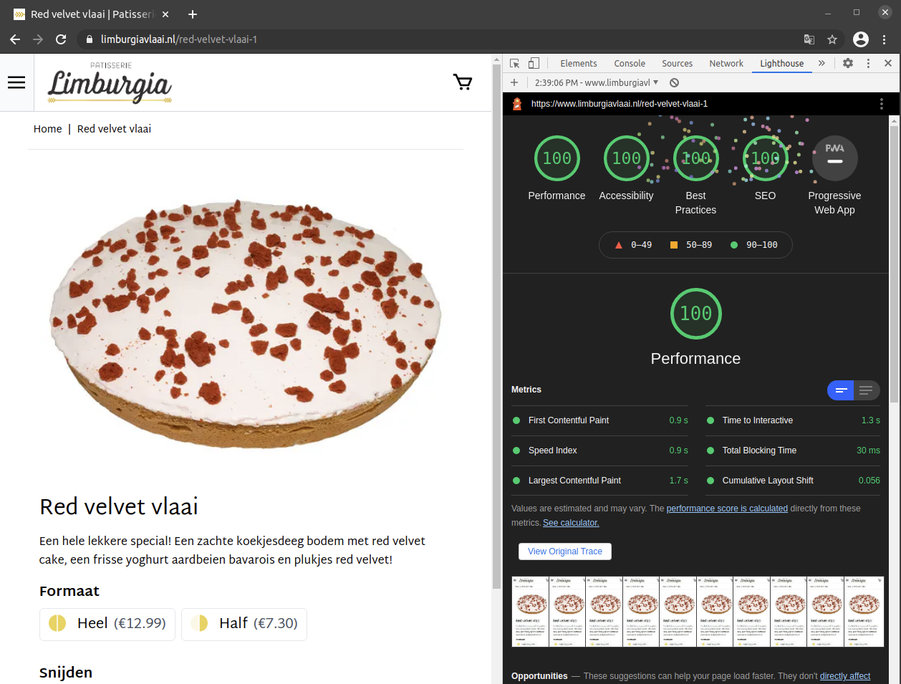

# Limburgia

#### van Limburgia Vlaai naar Patisserie Limburgia

Limburgia werd in 1901 opgericht en is in 1954 overgenomen door de huidige eigenaar, de familie De Haas. Een trots en prachtig 120 jaar oud familiebedrijf!

Limburgia heeft besloten een naamsverandering te ondergaan van Limburgia Vlaai naar Patisserie Limburgia. Hierbij hoort een update van de huisstijl en een nieuw design voor de webshop. De huisstijl is door een extern bureau ontwikkeld en de redesign van de shop mochten wij voor onze rekening nemen!

## Doelen

De bestaande Magento 2 shop draaide op een third-party thema, wat de nodige problemen veroorzaakte. Nieuwe features waren lastig in te bouwen vanwege de slechte kwaliteit van het thema en Magento upgrades kostten daarom veel tijd om door te voeren.

Met de aankondiging van Google's [Core Web Vitals](https://web.dev/vitals/) werd bovendien duidelijk dat dit de grootste aandacht moest krijgen om de hoge organische Google posities op belangrijke keywords te behouden. De drie belangrijkste metrics voor Core Web Vitals zijn de volgende drie:

- [Largest Contentful Paint](https://web.dev/lcp/)
- [First Input Delay](https://web.dev/fid/)
- [Cumulative Layout Shift](https://web.dev/cls/)

Met veel third-party thema's is het zeer lastig om deze waardes in de groene zone te krijgen. Ook al lukt het vandaag, het is geen schaalbare situatie meer. Bij een aanpassing van Google, moet je mogelijk weer door alle hoepels heen springen om net aan de Web Vitals te voldoen.

Ook Magento 2's eigen Luma thema komt niet in de buurt van wat Google als eis stelt vanaf mei 2021. Ons doel was om [Lighthouse](https://web.dev/measure/)-scores van boven de 95 punten **op mobiel** te halen.

Dus concreet hebben we 3 doelen geformuleerd:

- Core web vitals doorstaan (met een oplossing voor de lange termijn)
- Performance scores op desktop EN mobile van boven de 95
- Betere development flow waardoor er kosten op de lange termijn bespaard worden

## Hyvä

We hebben daarom ervoor gekozen om het redesign van Limburgia te bouwen op [Hyvä](https://hyva.io), een Magento theme die compleet vanaf de grond af aan is opgebouwd om hoge scores op de Core Web Vitals te behalen. Hyvä stelde ons niet alleen in staat om deze hoge scores te behalen, maar ook om de complexiteit van de frontend sterk te verminderen, waardoor niet alleen de ontwikkelsnelheid omhoog gaat maar, geheel niet onbelangrijk, het werkplezier van de developers ook!

Door Hyvä is de webshop makkelijker te onderhouden en kunnen nieuwe features sneller worden toegevoegd. Het leent zich dus perfect voor de grotere webshops, want hoe meer maatwerk, hoe meer uren bespaard kunnen worden met Hyvä ten opzichte van andere Magento themes.

## Behaalde resultaten

Lastig bij deze vergelijkingen is altijd de gebruikte testomgeving. In het verleden zijn wij wel eens de fout in gegaan om bij een PWA de computer van de developer te gebruiken & het internet op ons kantoor als benchmark. Maar elke computer en elke internetverbinding is. Op het moment van schrijven kunnen we ook niet de field data gebruiken van Google (die strikt gezien het meest objectief is), want dit is op basis van 28 dagen, en de nieuwe shop staat pas een paard dagen live.

Gelukkig heeft Chrome hier een oplossing voor. Door gebruik te maken van network & CPU throttling wordt een standaard computer- en internetverbinding gesimuleerd. Voor deze tests hebben we de snelheid van de internetverbinding gezet op `Fast 3G`. We gaan er van uit dat een groot gedeelte van de klanten toegang heeft tot 4G of sneller (WiFi), dus zou testen op 3G prima moeten zijn. De CPU van de laptop hebben we op 4x langzamer gezet dan gemiddeld.

Dan krijgen we op desktop de volgende score:

## Nieuwe functionaliteiten

Aangezien we toch aan het bouwen waren met een nieuwe frontend is er op de achtergrond ook veel werk verricht. De Magento installatie is geupgrade, ongebruikte modules zijn verwijderd en de installatie is in z'n geheel opgeschoond. Het is nu voor de klant ook mogelijk om de individuele winkel-pagina van de ruim 40 winkels aan te passen, alsmede de openingstijden van die winkels.

In de checkout kan namelijk worden gekozen voor een winkel die de levering doet, of waar de bestelling opgehaald kan worden. De dichtstbijzijndste geopende winkel wordt op basis van de ingevoerde postcode voorgeselecteerd.

## Geoptimaliseerde checkout

Voor de checkout is besloten de standaard checkout van Magento te vervangen door een [React-gebaseerde checkout](https://github.com/hyva-themes/magento2-hyva-checkout). Deze geeft ons meer flexibiliteit in het toevoegen van functionaliteit, zoals de winkelselectie en de bezorg/afhaaldatum functionaliteit. Daarnaast is deze checkout vele malen sneller dan de standaard Magento checkout.

## Verbeterde middleware koppeling

Limburgia levert niet alleen aan consumenten, maar ook aan andere bedrijven door middel van een aantal B2B shops. De bestellingen van alle shops en van de kassa's in de fysieke winkels worden samengevoegd in een middleware systeem, dat op zijn beurt de bestellingen doorzet naar het ERP in de bakkerij. Wij hebben deze middleware koppeling geschikt gemaakt voor Magento 2 en we hebben synchronisatie-functionaliteiten toegevoegd om de systemen beter met elkaar in de pas te laten lopen.

## Verhuizing naar Hypernode

Om de uptime en de snelheid van de shop veliig te stellen, hebben we ervoor gekozen om de webshop te verhuizen naar het [Hypernode](https://www.hypernode.com) platform. Wij hosten al vele jaren naar volle tevredenheid al onze klanten bij Hypernode en ook deze verhuizing ging verbazingwekkend soepel.

## Geinteresseerd?

Ben je nieuwschrierig geworden naar de mogelijkheden voor je magento 2 shop? Zit je op shopify en wordt begint het te rammelen aan alle kanten? Onze trajecten beginnen vaak als volgt:

1. Kennismaking
2. Audit van de huidige situatie & code
3. Schrijven van een kosten raming
4. Beginnen met ontwikkelen

Je kan ons altijd even bellen op 050 700 15 15 of mailen op wouter@elgentos.nl, peterjaap@elgentos.nl of jeroen@elgentos.nl.